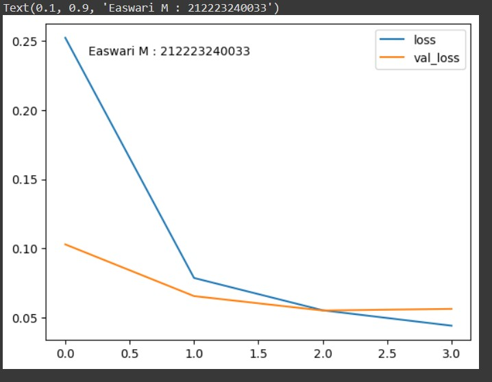

# Convolutional Deep Neural Network for Digit Classification

## AIM

To Develop a convolutional deep neural network for digit classification and to verify the response for scanned handwritten images.

## Problem Statement and Dataset

Problem Statement : Verify the response for scanned handwritten images.

The MNIST dataset is a collection of handwritten digits. The task is to classify a given image of a handwritten digit into one of 10 classes representing integer values from 0 to 9, inclusively. The dataset has a collection of 60,000 handwrittend digits of size 28 X 28.A convolutional neural network model is used so that it may be able to classify to it's appropriate numerical value.

## Neural Network Model


## DESIGN STEPS

### STEP 1:
Import tensorflow and preprocessing libraries.

### STEP 2:
Download and load the dataset

### STEP 3:
Use encoders and split datas for training & test

###  STEP 4:
Build,train,compile and fit the model

### STEP 5
Plot loss and accuracy values

### STEP 6 
Train with single data and predict the single output

## PROGRAM

### Name: Easwari M
### Register Number: 212223240033


```
import numpy as np
from tensorflow import keras
from tensorflow.keras import layers
from tensorflow.keras.datasets import mnist
import tensorflow as tf
import matplotlib.pyplot as plt
from tensorflow.keras import utils
import pandas as pd
from sklearn.metrics import classification_report,confusion_matrix
from tensorflow.keras.preprocessing import image

(X_train, y_train), (X_test, y_test) = mnist.load_data()


X_train.shape


X_test.shape

single_image= X_train[4000]

single_image.shape

plt.imshow(single_image,cmap='PuBu')

y_train.shape


X_train.min()

X_train.max()

X_train_scaled = X_train/255.0
X_test_scaled = X_test/255.0


X_train_scaled.min()

X_train_scaled.max()

y_train[0]

y_train_onehot = utils.to_categorical(y_train,10)
y_test_onehot = utils.to_categorical(y_test,10)

type(y_train_onehot)

y_train_onehot.shape

single_image = X_train[500]
plt.imshow(single_image,cmap='Spectral')

y_train_onehot[500]

X_train_scaled = X_train_scaled.reshape(-1,28,28,1)
X_test_scaled = X_test_scaled.reshape(-1,28,28,1)

X_test_scaled.shape

print("Name : Easwari M")
print("Register Number : 212223240033")

classifier = keras.Sequential()
c1=layers.Input(shape=(28,28,1))
classifier.add(c1)
c2=layers.Conv2D(filters=32,kernel_size=(3,3),activation='relu')
classifier.add(c2)
c3=layers.MaxPool2D(pool_size=(2,2))
classifier.add(c3)
c4=layers.Flatten()
classifier.add(c4)
c5=layers.Dense(32,activation='relu')
classifier.add(c5)
c6=layers.Dense(64,activation='relu')
classifier.add(c6)
c7=layers.Dense(32,activation='relu')
classifier.add(c7)
c8=layers.Dense(10,activation='softmax')
classifier.add(c8)


classifier.summary()

classifier.compile(loss='categorical_crossentropy',
              optimizer='adam',
              metrics='accuracy')

classifier.fit(X_train_scaled ,y_train_onehot, epochs=4,
     batch_size=64,
     validation_data = (X_test_scaled,y_test_onehot))


metrics = pd.DataFrame(classifier.history.history)

metrics.head()

metrics[['accuracy','val_accuracy']].plot()
plt.text(0.1, 1.0, f'Easwari M : 212223240033', transform=plt.gca().transAxes)

metrics[['loss','val_loss']].plot()
plt.text(0.1, 0.9, f'Easwari M : 212223240033', transform=plt.gca().transAxes)

x_test_predictions = np.argmax(classifier.predict(X_test_scaled), axis=1)


print(confusion_matrix(y_test,x_test_predictions))

print(classification_report(y_test,x_test_predictions))

img = image.load_img('num.jpg')


type(img)

img = image.load_img('num.jpg')
img_tensor = tf.convert_to_tensor(np.asarray(img))
img_28 = tf.image.resize(img_tensor,(28,28))
img_28_gray = tf.image.rgb_to_grayscale(img_28)
img_28_gray_scaled = img_28_gray.numpy()/255.0

x_single_prediction = np.argmax(
    classifier.predict(img_28_gray_scaled.reshape(1,28,28,1)),
     axis=1)

print(x_single_prediction)


plt.imshow(img_28_gray_scaled.reshape(28,28),cmap='Greens')

img_28_gray_inverted = 255.0-img_28_gray
img_28_gray_inverted_scaled = img_28_gray_inverted.numpy()/255.0


x_single_prediction = np.argmax(
    classifier.predict(img_28_gray_inverted_scaled.reshape(1,28,28,1)),
     axis=1)

plt.imshow(img_28_gray_inverted_scaled.reshape(28,28),cmap='gray')

print(x_single_prediction)


```

## OUTPUT

### Training Loss, Validation Loss Vs Iteration Plot




### Classification Report


### Confusion Matrix


### New Sample Data Prediction


## RESULT
A convolutional deep neural network  to verify the scanned handwritten images is developed sucessfully.
